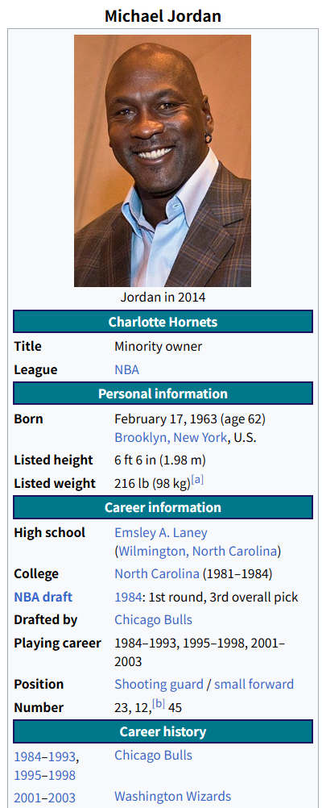

## Strings I:

```{r}
library(stringr)
head(fruit)

# 1. What data structure is fruit and what is its length?
typeof(fruit)
class(fruit)
str(fruit)
length(fruit)

# fruit is character vector.  The length of the vector is 80.

#2. Which fruits have the longest and shortest names?
fruit[which.max(str_length(fruit))]
fruit[which.min(str_length(fruit))]

#3. Replace the entry "currant" with "red currant".
fruit[fruit == "currant"] <- "red currant"

#4. Form a single string that starts with "My favorite fruits are" and then lists all of the fruits, separated by a comma and a space. The end of the list should have "and" before the last fruit and end with a period.

result <- paste0( "My favorite fruits are ",
                    paste(head(fruit, -1), collapse = ", "),
                    " and ",
                    tail(fruit, 1), ".")

print(result)

# 5. Form a string like the following but with another fruit and emoji
emojis <- c("\U0001f604")
result2 <- paste( emojis, fruit[2], emojis)

str(result2)

# 6. Print all of the fruit names containing berry.

fruit[str_detect(fruit, "berry")]

# 7. How many fruit names contain the letter "o"?
sum(str_detect(fruit, "o"))

#8. Which fruits names contain the most "o"s?
fruit[which.max(str_count(fruit,"o"))]

#9. How many fruits feature two "a"s separated by one other character?
#fruit[str_detect(fruit, "a[^a]{1}a")]
#sum(str_detect(fruit, "a[^a]{1}a"))

```

## Strings II

```{r}
library(babynames)
library(tidyverse)
babynames
str(babynames)

#10. What does every row refer to, i.e. what is the unit of observation? What time range is covered by this data? How is prop calculated (what is the numerator and demoninator)?

babynames  |> summarise( p_t = sum(prop), .by = c("year", "sex"))
# Should be the statistic of the baby name and dex per year.  n is the numberator, and the sum of n grouped by year and sex is the demoniator. The sum of prop grouped by year and sex is close to 1.

#11. In 2010, what proportion of boys names ended with a vowel? How about girls names? How does those proportions differ when calculated in 1910?

b_2010 <- babynames |> filter(year == 2010, sex == "M")
sum(b_2010$prop[str_detect(b_2010$name, "[aeiou]$")])

g_2010 <- babynames |> filter(sex == 'F', year == 2010)
sum(g_2010$prop[str_detect(g_2010$name, "[aeiou]$")])

b_1910 <- babynames |> filter(sex == "M", year ==1910)
sum(b_1910$prop[str_detect(b_1910$name,"[aeiou]$")])

g_1910<-babynames |> filter(sex == "F", year == 1910)
sum(g_1910$prop[str_detect(g_1910$name, "[aeiou]$")])


#12. Narrow down the data frame to the rows with names that end in a diminuitive (e.g. “Joey” and “Juanita”). Do some research to gather a set of diminuitives used in languages found in American baby names.
##TBD!!!!!!!!!!!!!!!!!!!!!!!!!!!!!


# 13. How many distinct names rhyme with “Aiden”?  Suppose the pattern to be:  [aAiI]+[^AEIOUaeiou]*den

babynames$name[str_detect(babynames$name, "[aAiI]+[^AEIOUaeiou]*den+$")] |> 
    unique() |> 
    length()


# 14. Create a plot like the following but for your name.

babynames |> 
    filter(name == "Jeff", sex == "M") |>
    ggplot(aes(x = year, y = prop)) +
    geom_line() +
    labs(title = "Popularity of the boy's name Jeff",
            x = "Year",
            y = "Popularity") +
    theme_linedraw()

# 15. Create a plot that shows the relatively frequency of a name shared by a historic ffgure over time (e.g. “Barack”).
# Michael Jordan,  NBA Star from 1984-2003
babynames |> 
    filter(name == "Jordan") |>
    summarise(prop = sum(prop),  .by = year ) |>
    ggplot(aes(x = year, y = prop)) +
    geom_line() +
    labs(title = "Popularity of the boy's name Jordan",
            x = "Year",
            y = "Popularity") +
    theme_linedraw()


# 16. Optional Challenge: For each year since 2000, which names have been the most gender neutral?


```



### 18 R has a built in palette of colors that you can access with colors(). 

Note that many of the colors in that palette have numbered variants that are different darknesses. How many colors are in this palette affer removing the numbered variants of a color?

```{r}
all_color_variants <- colors()
length(all_color_variants[str_detect(all_color_variants, "[^0-9]$")])


```

### 19-25

The following questions deal with the chorus of the song, “Golden”, but Huntrix. Be sure they copy into
R as a string that captures the new line characters. Provide the code to programmatically answer each
question. There are many ways to answer these questions but str_split() might be helpful.


```{r}
x <- "We're goin' up, up, up, it's our moment
You know together we're glowing
Gonna be, gonna be golden
Oh, up, up, up, with our voices
\uc601\uc6d0\ud788 \uae68\uc9c8 \uc218 \uc5c6\ub294
Gonna be, gonna be golden"

# \uc601\uc6d0\ud788  -> forever
# \uae68\uc9c8 -> break
#  \uc218 -> number
# \uc5c6\ub294   -> no

str_view(x)
# 19  How many lins are in the chorus?
str_count(x, "\n") + 1
# Totally 6 lines,  5 newline character plus the first line.

#20. How many times is the word "up” used in the chorus?
str_count(x, "\\bup\\b")

#21. How many distinct four letter words are used?
 length(str_unique(str_match_all(x, "\\b\\w{4}\\b")[[1]]))


#22. Replace each of the contractions with the expanded english equivalent.
patterns<- c("\uc601\uc6d0\ud788"="forever","\uae68\uc9c8"="break","\uc218"="number","\uc5c6\ub294"="no")
str_replace_all(x,patterns)

#23. What is the ffrst word of each line?  

lines <- str_split(x, "\n")
first_words <- str_match(unlist(lines), "^\\w+\\b")
print(first_words)

#24. How many words are in each line?

str_count(unlist(lines), "\\w+")
#25. Provide a new string that writes the Korean word for “Golden” using the appropriate Unicode characters.


```